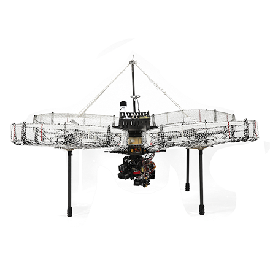

# 机器人及各兵种简介

RoboMaster机甲大师赛中有步兵、英雄、工程、哨兵、空中机器人、飞镖机器人等多种兵种，每个兵种都有其独特的功能和作用，以下是具体介绍：

* **步兵机器人**：是赛场上机动性最高的机器人，编号通常为3-5。它配备“视觉识别”“发射模块”“云台模块”等，可发射17mm塑胶弹丸，是对敌方有生力量造成主要打击的兵种，能通过视觉算法精准打击敌方装甲板，还可攻击场地中央的能量机关，为队伍获取攻击力增益等效果。
*

    <figure><figcaption></figcaption></figure>
* **英雄机器人**：装备“视觉模块”“供弹模块”“大陀螺模块”等，能够发射42mm塑胶弹丸，是赛场上唯一可以发射大弹丸的机器人。其主要作用是对敌方前哨站以及基地造成主要输出，在一定程度上决定着比赛的走向。

<figure><figcaption></figcaption></figure>

* **工程机器人**：包含“底盘模块”“抓取模块”“救援模块”等。它在比赛中负责抓取经济矿石并进行兑换，为队伍获取经济优势，还能对己方已阵亡的机器人进行救援，可通过“刷卡复活”或拖回基地旁补血点的方式让队友复活。

<figure><figcaption></figcaption></figure>

* **哨兵机器人**：是己方基地的全自动防御机器人，安装有“发射模块”“视觉模块”“上下云台模块”等，发射17mm塑胶弹丸。它被悬挂在基地前方的导轨上往复运动，通过视觉算法识别敌方机器人并进行全自动打击，在存活时能为基地提供防御加成，相当于“移动的防御塔”。

<figure><figcaption></figcaption></figure>

* **空中机器人（无人机）**：配备“云台模块”“发射模块”“交互模块”等，同样发射17mm塑胶弹丸。其主要作用是给其他兵种操作手提供视野，在己方经济允许时，可携带大量弹药升空，对敌方前哨站或基地进行强力输出。

<figure><figcaption></figcaption></figure>

* **飞镖机器人**：是2021赛季的新兵种。飞镖闸门开启后，可对敌方前哨站或基地进行超远距离打击，在一定情况下能直接对对方基地造成极大伤害，可谓是赛场上的“核武”。

<figure><figcaption></figcaption></figure>

更多信息参见：[https://www.robomaster.com/zh-CN/robo/rm](https://www.robomaster.com/zh-CN/robo/rm?djifrom=rmu1)
